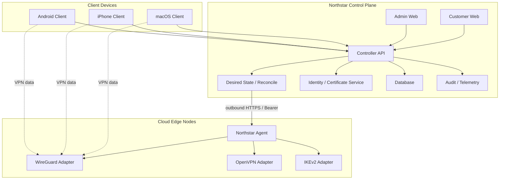

# 01. 系统架构

## 1. 总体拓扑



## 2. 组件职责

### Controller

负责：

- Web Console 和 API；
- 用户、设备和节点管理；
- Profile 和协议能力选择；
- IP Lease 分配；
- Desired State 生成；
- Agent 任务编排；
- 证书签发/轮换协调；
- 审计、指标和告警。

不负责：

- 转发 VPN 用户流量；
- 直接向节点执行任意命令；
- 长期保存所有客户端私钥；
- 把某个具体 VPN 协议写死在用户模型中。

### Edge Node

负责：

- 承载一个或多个 VPN 数据面；
- 本地保存节点私钥；
- 运行 Northstar Agent；
- 应用签名/授权后的配置；
- 上报心跳、握手和流量统计；
- 在本地执行有限的 allow-listed 操作。

### Client

负责：

- 生成并保护设备/协议私钥；
- 登录并注册设备；
- 获取 Connection Profile；
- 选择和切换协议/节点；
- 调用系统 VPN API；
- 上报连接状态和诊断信息。

## 3. 信任边界

```text
管理员浏览器 -- HTTPS/session --> Controller
客户端 App   -- HTTPS/device auth --> Controller
Node Agent   -- HTTPS + per-node Bearer --> Controller Agent Gateway
VPN Client   -- protocol tunnel --> Edge Node
SSH          -- bootstrap/recovery only --> Edge Node
```

SSH 不属于正常控制通道。Agent 正常工作后，节点不需要对公网开放管理 SSH；如果保留 SSH，应限制来源 IP、使用 host key 校验和短期凭据。

## 4. 关键数据流

### 节点加入

```text
创建节点
  -> 生成一次性 bootstrap token
  -> SSH host key 校验
  -> 安装 Agent / VPN runtime
  -> Agent 本地生成身份和节点密钥
  -> Controller 保存每节点 Agent token 的哈希
  -> Controller 下发 Desired State
  -> Agent 应用配置并上报结果
```

### 设备加入

```text
用户登录
  -> 创建 Device
  -> 客户端生成协议私钥
  -> 上传公钥或 CSR
  -> Controller 分配 Node / IP Lease
  -> 生成 Connection Profile
  -> 客户端保存到 Keychain/Keystore
  -> 系统 VPN Extension 启动 Tunnel
```
