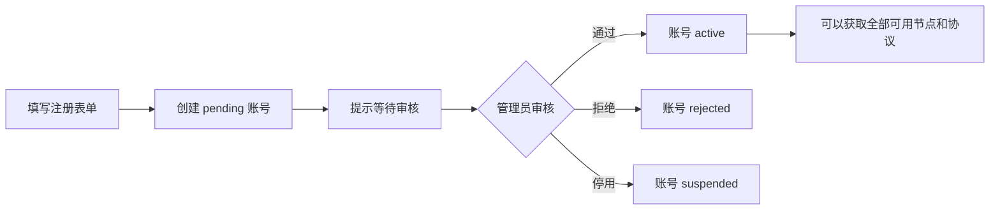
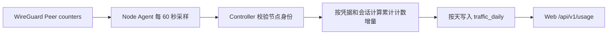

# C 端用户 Web 站点设计

## 1. 产品定位

第一版面向周围人使用，目标是让一个新用户在被管理员审核后，能够自己完成：

```text
注册 -> 等待审核 -> 登录 -> 创建连接凭据 -> 选择区域/协议 -> 获取配置 -> 导入 VPN 客户端
```

第一版不做：

- 支付、套餐、优惠券、流量配额和流量计费；
- 邀请裂变和复杂的组织/租户；
- 浏览器内直接建立 VPN 隧道；
- 面向 C 端暴露节点 IP、服务器密钥或运维信息。

Web 是账号和配置门户。实际 VPN 连接由未来的 Android/iOS/macOS/Windows 原生客户端完成；在客户端完成前，Web 可以下载 WireGuard/OpenVPN 配置并交给对应的第三方客户端导入。

## 2. 部署边界

C 端 Web、管理后台和 Controller/API 作为独立进程和独立端口运行。Portal 和 Admin 不直接访问数据库，只通过同一个版本化 API。

```text
portal-web      :3100 -> C 端用户 Web
admin-web       :3200 -> 管理后台 Web
controller      :3000 -> API + 控制面

app.example.com          -> portal-web:3100
portal-web/api           -> http://northstar:3000（Docker 内网）
console.example.com      -> admin-web:3200
admin-web/api            -> http://northstar:3000（Docker 内网）
api.example.com          -> controller:3000/api/v1（给原生客户端）
```

浏览器仍然同源访问 `/api`，但请求到达 Portal/Admin 后，由前端容器通过 Docker 服务名 `northstar` 转发到 Controller。宿主机 Nginx 不参与站点 API 路由，也不需要开放跨域 Cookie。原生客户端和远程 Agent 才使用独立 API 域名。

当前仓库已经增加独立的 `portal-web/` 和 `admin-web/` 应用及 Docker 服务；它们只调用 API，不直接访问 PostgreSQL。后续拆成独立代码仓库不会改变 API 和客户端。

推荐的生产拓扑：

```text
Internet
  ├── app.example.com     -> Nginx -> portal-web:3100
  │                              └── /api -> northstar:3000（Docker 内网）
  ├── console.example.com -> Nginx -> admin-web:3200
  │                              └── /api -> northstar:3000（Docker 内网）
  └── api.example.com      -> Nginx -> controller:3000
```

域名变化不应影响业务 API 和客户端，因为客户端只依赖 `/api/v1` 合同。

## 3. 最小页面结构

### 未登录区

| 路径 | 页面 | 目标 |
| --- | --- | --- |
| `/` | 首页 | 说明“审核后可使用 VPN”，提供登录/注册入口 |
| `/register` | 注册 | 昵称、邮箱、密码、确认密码 |
| `/login` | 登录 | 邮箱、密码；显示审核中/已拒绝/已停用状态 |
| `/pending` | 等待审核 | 明确告知申请已提交，不需要重复注册 |

### 登录后区

| 路径 | 页面 | 目标 |
| --- | --- | --- |
| `/dashboard` | 首页 | 账号状态、可用区域、连接凭据、配置和流量 |
| `/credentials` | 我的凭据 | 创建、改名、查看、下载和撤销连接凭据 |
| `/profiles` | VPN 配置 | 生成、激活、下载和撤销配置 |
| `/account` | 账号 | 修改昵称、退出登录 |

Portal 以连接凭据为唯一用户可见主对象。`devices` 仅作为旧客户端和内部地址分配的兼容载体，不在新界面展示。

## 4. 用户体验流程

### 注册和审核



注册成功后不自动获得 VPN 权限。登录接口必须根据账号状态返回明确错误码：

- `USER_PENDING`：账号审核中；
- `USER_REJECTED`：申请未通过；
- `USER_SUSPENDED`：账号已停用；
- `USER_ACTIVE`：允许继续登录。

第一版不强制邮箱验证，采用人工审核作为主要控制点。后续如果公开开放注册，再增加邮箱验证、验证码和邀请链接。

### 获取配置

```text
账号 active
  -> 创建并命名一份连接凭据
  -> 选择区域
  -> 选择协议（默认 WireGuard）
  -> Controller 根据凭据身份签发 Profile
  -> 用户激活 Profile
  -> 下载 .conf / .ovpn 或由原生客户端直接拉取
```

配置可以复制到多个客户端。系统不追踪或区分物理设备；在线连接数、最后活动和流量全部聚合到连接凭据。撤销凭据会使其所有配置副本同时失效。OpenVPN 支持同证书并发会话；WireGuard 同一公钥建议同一时间只由一个客户端连接。

## 5. 页面视觉和交互

视觉上保持简单、可信和偏工具化，不做营销型复杂首页：

- 浅色背景、深色文字、一个绿色状态色；
- 首页只保留品牌、用途、审核说明、登录/注册按钮；
- Dashboard 第一屏只放“账号状态”“可用区域”“我的连接凭据”“流量趋势”；
- 所有连接信息使用状态标签：`可用`、`准备中`、`不可用`；
- 移动端优先，表单单列，按钮高度至少 44px；
- 不展示服务器 IP、Agent、SSH、节点负载和控制面日志；
- 下载按钮明确显示协议和文件类型，例如“下载 WireGuard 配置”。

Dashboard 的最小布局：

```text
┌──────────────────────────────────────┐
│ Northstar                 账号 / 退出 │
├──────────────────────────────────────┤
│ 账号状态                              │
│ 已审核，可使用全部可用 VPN            │
├──────────────────────────────────────┤
│ 选择 VPN 区域                          │
│ [东京 可用] [新加坡 可用] [法兰克福…]  │
├──────────────────────────────────────┤
│ 我的连接凭据          [+ 创建凭据]     │
│ 个人 VPN · WireGuard · 在线（1 条连接）│
├──────────────────────────────────────┤
│ 流量统计                              │
│ 今日 1.2 GB   本月 18.6 GB              │
│ 下载 14.1 GB  上传 4.5 GB               │
├──────────────────────────────────────┤
│ 凭据与配置                            │
│ Tokyo / WireGuard   [下载] [改名] [撤销]│
└──────────────────────────────────────┘
```

### 流量统计展示

第一版只做统计，不做限制和计费。Dashboard 展示：

- 今日总流量；
- 本月总流量；
- 下载量和上传量；
- 最近 7 天按天趋势；
- 按连接凭据、区域查看汇总；
- 数据更新时间和“统计可能延迟 1–2 分钟”的提示。

定义统一使用用户视角：

```text
用户上传 = VPN 服务端从客户端 Peer 收到的字节数
用户下载 = VPN 服务端发送给客户端 Peer 的字节数
总流量   = 上传 + 下载
```

## 6. 流量采集和统计设计

### 采集链路



第一版采用累计计数而不是每个数据包写库：

- WireGuard Agent 读取每个 Peer 的 `receive_bytes`、`transmit_bytes` 和最近握手时间；
- Agent 通过心跳携带 `usageSnapshots`，用户量增大后再拆成独立的 `/api/v1/agent/usage-snapshot`；
- Controller 根据 Peer 公钥或 OpenVPN Common Name 映射到 AccessCredential，再计算本次与上次采样的差值；
- 只保存每个身份的最新累计计数和按天汇总，默认不保存每分钟明细；
- Agent 重启或计数器回退时识别为 counter reset，不产生负数；
- 每个样本必须带 `observedAt`、`counterEpoch` 和 `nodeId`，避免重复上报造成重复统计。

OpenVPN Agent 为每个连接上报稳定的 `sessionKey`，同一证书的多个会话分别计算计数器差值，再聚合到凭据。未能映射到 AccessCredential 的身份只计入节点未知流量，不归属给任何用户。

### 数据表

```text
traffic_counters
  node_id
  protocol
  identity_key          WireGuard public key 或 OpenVPN Common Name
  session_key           OpenVPN 会话标识；WireGuard 为空
  credential_id         nullable，映射失败时为空
  observed_rx_bytes     BIGINT
  observed_tx_bytes     BIGINT
  last_handshake_at     nullable
  last_traffic_at       nullable
  connected             当前采样是否仍存在
  counter_epoch
  observed_at
  UNIQUE(node_id, protocol, identity_key, session_key)

traffic_daily
  day                   UTC date
  user_id
  credential_id
  node_id
  protocol
  upload_bytes          BIGINT
  download_bytes        BIGINT
  first_seen_at
  last_seen_at
  UNIQUE(day, device_id, node_id, protocol)  # device_id 仅为旧表兼容键
```

`traffic_daily` 的 `user_id` 是冗余字段，用于快速查询；所有写入必须由 Controller 根据凭据归属生成，不能信任 Agent 或浏览器提交的用户 ID。所有字节字段使用整数，API 也返回整数，单位格式化只在前端完成。

### 用户流量 API

```text
GET /api/v1/usage/summary?from=2026-07-01&to=2026-07-26
GET /api/v1/usage/timeseries?from=2026-07-01&to=2026-07-26&groupBy=day
GET /api/v1/credentials?from=2026-07-01&to=2026-07-26
GET /api/v1/usage/regions?from=2026-07-01&to=2026-07-26
```

`GET /api/v1/usage/devices` 继续为旧客户端保留，但新 Portal 和新客户端不得以它构建产品界面。

响应中的核心字段：

```json
{
  "from": "2026-07-01",
  "to": "2026-07-26",
  "updatedAt": "2026-07-26T08:30:00.000Z",
  "totals": {
    "uploadBytes": 4831838208,
    "downloadBytes": 15118284800,
    "totalBytes": 19950123008
  },
  "daily": [
    { "day": "2026-07-25", "uploadBytes": 1234, "downloadBytes": 5678 }
  ]
}
```

用户只能查询自己的数据；管理员可以在管理端按用户、连接凭据、节点查询，但管理端统计 API 与 C 端 API 分开授权。

## 7. API 复用原则

Web 和原生客户端共用同一套业务 API；区别只在认证载体：

```text
Web      -> HttpOnly Cookie Session
Android  -> Bearer access token + refresh token
iOS      -> Bearer access token + refresh token
macOS    -> Bearer access token + refresh token
Windows  -> Bearer access token + refresh token
```

API route 只负责鉴权、输入校验和响应映射，账号审核、Credential、Profile 和节点选择逻辑继续放在 service/control-plane 层。不要让 Web 单独复制一套“简化业务逻辑”。

### C 端核心 API

| 方法 | 路径 | 说明 |
| --- | --- | --- |
| `POST` | `/api/v1/auth/register` | 创建 `pending` 用户，不直接发放 VPN 权限 |
| `POST` | `/api/v1/auth/login` | 登录；同时校验用户审核状态 |
| `POST` | `/api/v1/auth/refresh` | 刷新原生客户端 access token |
| `POST` | `/api/v1/auth/logout` | 注销当前会话/token |
| `GET` | `/api/v1/auth/me` | 返回用户资料和 `status` |
| `GET` | `/api/v1/availability` | 返回用户可见的区域、协议和健康状态 |
| `GET` | `/api/v1/credentials` | 当前用户的连接凭据、在线状态和流量 |
| `POST` | `/api/v1/credentials` | 创建并命名连接凭据 |
| `PATCH` | `/api/v1/credentials/:id` | 修改凭据显示名称，不轮换密钥 |
| `POST` | `/api/v1/credentials/:id/revoke` | 撤销凭据及其全部配置副本 |
| `GET` | `/api/v1/profiles` | 当前用户的连接配置 |
| `POST` | `/api/v1/profiles` | 按凭据和区域签发配置 |
| `POST` | `/api/v1/profiles/:id/activate` | 激活刚签发的 Profile |
| `GET` | `/api/v1/profiles/:id/download` | 下载 `.conf` 或 `.ovpn`，禁止缓存 |
| `GET` | `/api/v1/usage/summary` | 查询当前用户流量汇总 |
| `GET` | `/api/v1/usage/timeseries` | 查询按天流量趋势 |
| `GET` | `/api/v1/usage/credentials` | 按凭据查询流量（兼容旧 Profile 明细） |
| `GET` | `/api/v1/usage/regions` | 按区域查询流量 |

`/api/v1/devices` 和 `/api/access/*` 保留为旧原生客户端兼容路径；新 Portal 与新客户端应使用 Credential/Profile API，不再向用户暴露设备模型。

### 管理员审核 API

```text
GET  /api/v1/admin/users?status=pending
POST /api/v1/admin/users/:id/status  { "status": "active" }
POST /api/v1/admin/users/:id/status  { "status": "rejected", "reason": "..." }
POST /api/v1/admin/users/:id/status  { "status": "suspended" }
GET  /api/v1/admin/users/:id/credentials?from=YYYY-MM-DD&to=YYYY-MM-DD
POST /api/v1/admin/users/:id/credentials  { "action": "revoke-credential", "credentialId": "..." }
POST /api/v1/admin/users/:id/credentials  { "action": "revoke-all-credentials" }

账号管理详情返回连接凭据、配置历史、OpenVPN 客户端公开证书和凭据级流量统计。
证书 PEM 属于公开材料，可以由管理员查看、复制和下载；客户端私钥不返回。
WireGuard 流量按凭据公钥归因。OpenVPN 以证书 Common Name 作为凭据身份，并用
会话标识分别累计同证书并发连接的流量，最终聚合到凭据维度。

账号被停用或拒绝时，Controller 同步清理 Web/API 会话，吊销其全部连接凭据、
配置与客户端证书，并下发节点收敛任务；恢复账号不会恢复已吊销凭据。
```

管理员审核操作必须写入 AuditEvent。审核通过后不需要为每个节点单独创建授权记录，用户状态是第一版的总开关。

Agent 上报接口在第一版可以复用现有心跳：

```json
{
  "nodeId": "tokyo-01",
  "usageSnapshots": [
    {
      "protocol": "wireguard",
      "identityKey": "client-public-key",
      "rxBytes": 123456,
      "txBytes": 654321,
      "lastHandshakeAt": "2026-07-26T08:29:00.000Z",
      "counterEpoch": "boot-uuid"
    }
  ]
}
```

## 8. 数据模型调整

当前 `users` 表需要增加审核字段：

```text
users
  status            pending | active | rejected | suspended
  approved_at      nullable
  approved_by      nullable user_id
  rejection_reason nullable
  updated_at       required
```

现有 `role` 保留并收敛为：

```text
owner   -> 系统所有者
admin   -> 审核用户、管理节点
member  -> C 端普通用户
```

连接凭据是 Web 与新客户端的跨平台统一实体：

```text
AccessCredential
  user_id
  display_name
  protocol       wireguard | openvpn
  identity_key   WireGuard 公钥或 OpenVPN Common Name
  status         active | expired | revoked
```

`Device` 只保留为旧客户端、IP Lease 和已有配置的内部兼容载体。新业务逻辑通过 `credential_id` 关联 Profile、证书、在线会话和流量。用户可以把同一配置复制到多个客户端，平台不会尝试识别物理设备。

新增 `traffic_counters` 和 `traffic_daily`，具体字段见“流量采集和统计设计”。第一版不增加用户流量余额或额度字段，避免把统计模型和未来计费模型耦合。

## 9. 权限和安全底线

- 所有获取 Profile 的接口都必须同时检查 `user.status = active`、凭据归属和凭据状态；
- C 端只拿到区域/协议/状态，不拿到节点管理信息；
- 下载响应必须 `Cache-Control: no-store`；
- Web session 使用 HttpOnly、Secure、SameSite Cookie；
- API access token 只用于原生客户端，refresh token 必须轮换并可撤销；
- 注册、登录、下载 Profile 都需要限流并写审计；
- 账号拒绝/停用后，现有 Credential、Profile 和证书立即失效；
- 不把客户端提交的 `endpoint`、`clientAddress`、`allowedIps` 当作可信输入；这些值全部由 Controller 生成；
- 不在 Web 页面显示私钥、服务器私钥、Agent token、SSH 凭据或内部日志。
- 流量统计只接受已认证 Agent 的采样，浏览器不能提交流量数字；
- 采样计数按节点、协议和身份去重，防止重复心跳重复累计；
- 账号停用后历史流量保留用于审计，但 C 端立即禁止继续查询和获取 Profile。

## 10. 第一阶段验收标准

### 用户侧

- 可以注册一个普通用户，注册后状态为 `pending`；
- pending 用户登录时看到等待审核页面，不能获取凭据、区域或 Profile；
- 管理员可以审核通过、拒绝和停用用户；
- active 用户登录后可以看到所有健康且已发布的区域；
- active 用户可以创建连接凭据、生成 Profile、激活并下载配置；
- 用户只能看到自己的连接凭据和 Profile；
- 撤销凭据后所有配置副本不可继续下载或连接；
- Dashboard 可以看到今日、本月、上传、下载和最近 7 天流量；
- 用户流量按凭据和区域汇总正确，统计延迟不超过约 2 分钟；
- OpenVPN 同证书并发连接分别计量，并在凭据层聚合连接数与流量；
- Portal 每 20 秒自动刷新，节点遥测中断时显示“状态未知”而不是误报离线；
- Agent 重启、节点重启、计数器归零不会产生负数或异常暴增；
- 移动端浏览器可以完成注册、登录和下载流程。

### 多端扩展

- Android/iOS/macOS/Windows 客户端只需实现同一套 `/api/v1`；
- 原生客户端可以创建凭据并直接拉取 Profile；旧版仍可通过 Device 兼容接口工作；
- Web 与原生客户端的用户、Credential、Profile、撤销和审核状态一致；
- 后续新增协议不需要改用户页面的数据模型，只新增协议能力和 Profile 渲染器。

## 11. 推荐开发顺序

1. 拆出独立 `portal-web` 应用和 `3100` 端口，Controller/API 保持 `3000`；
2. 给 `users` 增加审核状态和管理端审核入口；
3. 增加 `/api/v1/auth/register`，并让所有用户态 API 校验 `active`；
4. 加入注册、登录、pending、dashboard 四个 C 端页面；
5. 增加 Credential/Profile API，并保留 Device API 作为旧客户端兼容层；
6. 在 Agent 心跳中加入 WireGuard Peer 累计计数，落地 `traffic_counters` 和 `traffic_daily`；
7. 加入用户流量 API 和 Dashboard 流量卡片；
8. 补齐 OpenVPN 下载、同证书并发会话采样和原生客户端凭据创建；
9. 真实用户验收后，再决定是否需要邮箱验证、邀请制或更细的节点权限。
