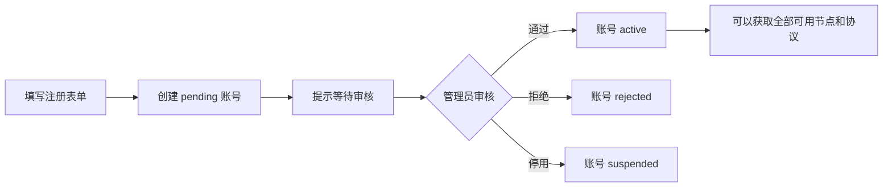

# C 端用户 Web 站点设计

## 1. 产品定位

第一版面向周围人使用，目标是让一个新用户在被管理员审核后，能够自己完成：

```text
注册 -> 等待审核 -> 登录 -> 添加设备 -> 选择节点/协议 -> 获取配置 -> 导入 VPN 客户端
```

第一版不做：

- 支付、套餐、优惠券、流量计费；
- 邀请裂变和复杂的组织/租户；
- 浏览器内直接建立 VPN 隧道；
- 面向 C 端暴露节点 IP、服务器密钥或运维信息。

Web 是账号和配置门户。实际 VPN 连接由未来的 Android/iOS/macOS/Windows 原生客户端完成；在客户端完成前，Web 可以下载 WireGuard/OpenVPN 配置并交给对应的第三方客户端导入。

## 2. 部署边界

第一阶段不拆成两个后端服务，使用同一个 Controller 和同一个 `/api/v1`：

```text
vpn.example.com/portal  -> C 端用户 Web
vpn.example.com/        -> 现有管理端，暂时保留
vpn.example.com/api/v1  -> Web、原生客户端共用的版本化 API
```

以后可以将域名拆成：

```text
app.example.com      -> C 端 Web
console.example.com  -> 管理端
api.example.com      -> API
```

域名变化不应影响业务 API 和客户端，因为客户端只依赖 `/api/v1` 合同。

## 3. 最小页面结构

### 未登录区

| 路径 | 页面 | 目标 |
| --- | --- | --- |
| `/portal` | 首页 | 说明“审核后可使用 VPN”，提供登录/注册入口 |
| `/portal/register` | 注册 | 昵称、邮箱、密码、确认密码 |
| `/portal/login` | 登录 | 邮箱、密码；显示审核中/已拒绝/已停用状态 |
| `/portal/pending` | 等待审核 | 明确告知申请已提交，不需要重复注册 |

### 登录后区

| 路径 | 页面 | 目标 |
| --- | --- | --- |
| `/portal/dashboard` | 首页 | 账号状态、可用区域、设备和最近配置 |
| `/portal/devices` | 我的设备 | 添加、查看、撤销设备 |
| `/portal/profiles` | VPN 配置 | 生成、激活、下载和撤销配置 |
| `/portal/account` | 账号 | 修改昵称、退出登录 |

为了保持轻量，第一版可以把 `devices` 和 `profiles` 合并在 Dashboard 中，只有用户量上来后再拆页面。

## 4. 用户体验流程

### 注册和审核



注册成功后不自动获得 VPN 权限。登录接口必须根据账号状态返回明确错误码：

- `USER_PENDING`：账号审核中；
- `USER_REJECTED`：申请未通过；
- `USER_SUSPENDED`：账号已停用；
- `USER_ACTIVE`：允许继续登录。

第一版不强制邮箱验证，采用人工审核作为主要控制点。后续如果公开开放注册，再增加邮箱验证、验证码和邀请链接。

### 获取配置

```text
账号 active
  -> 添加一个设备（原生客户端注册，或浏览器生成“配置下载设备”）
  -> 选择区域
  -> 选择协议（默认 WireGuard）
  -> Controller 根据策略签发 Profile
  -> 用户激活 Profile
  -> 下载 .conf / .ovpn 或由原生客户端直接拉取
```

“全部的 VPN”在第一版的含义是：账号审核通过后，不再做单独的节点白名单，用户可以看到所有健康且已发布的区域和协议。节点是否展示仍由 Controller 的服务状态、协议能力和客户端平台能力决定。

## 5. 页面视觉和交互

视觉上保持简单、可信和偏工具化，不做营销型复杂首页：

- 浅色背景、深色文字、一个绿色状态色；
- 首页只保留品牌、用途、审核说明、登录/注册按钮；
- Dashboard 第一屏只放“账号状态”“可用区域”“我的设备”“最近配置”；
- 所有连接信息使用状态标签：`可用`、`准备中`、`不可用`；
- 移动端优先，表单单列，按钮高度至少 44px；
- 不展示服务器 IP、Agent、SSH、节点负载和控制面日志；
- 下载按钮明确显示协议和文件类型，例如“下载 WireGuard 配置”。

Dashboard 的最小布局：

```text
┌──────────────────────────────────────┐
│ Northstar                 账号 / 退出 │
├──────────────────────────────────────┤
│ 账号状态                              │
│ 已审核，可使用全部可用 VPN            │
├──────────────────────────────────────┤
│ 选择 VPN 区域                          │
│ [东京 可用] [新加坡 可用] [法兰克福…]  │
├──────────────────────────────────────┤
│ 我的设备              [+ 添加设备]     │
│ MacBook Pro · macOS · 正常             │
├──────────────────────────────────────┤
│ 最近配置                              │
│ Tokyo / WireGuard       [下载配置]     │
└──────────────────────────────────────┘
```

## 6. API 复用原则

Web 和原生客户端共用同一套业务 API；区别只在认证载体：

```text
Web      -> HttpOnly Cookie Session
Android  -> Bearer access token + refresh token
iOS      -> Bearer access token + refresh token
macOS    -> Bearer access token + refresh token
Windows  -> Bearer access token + refresh token
```

API route 只负责鉴权、输入校验和响应映射，账号审核、设备、Profile 和节点选择逻辑继续放在 service/control-plane 层。不要让 Web 单独复制一套“简化业务逻辑”。

### C 端核心 API

| 方法 | 路径 | 说明 |
| --- | --- | --- |
| `POST` | `/api/v1/auth/register` | 创建 `pending` 用户，不直接发放 VPN 权限 |
| `POST` | `/api/v1/auth/login` | 登录；同时校验用户审核状态 |
| `POST` | `/api/v1/auth/refresh` | 刷新原生客户端 access token |
| `POST` | `/api/v1/auth/logout` | 注销当前会话/token |
| `GET` | `/api/v1/auth/me` | 返回用户资料和 `status` |
| `GET` | `/api/v1/availability` | 返回用户可见的区域、协议和健康状态 |
| `GET` | `/api/v1/devices` | 当前用户的设备 |
| `POST` | `/api/v1/devices` | 注册设备或配置下载设备 |
| `POST` | `/api/v1/devices/:id/revoke` | 撤销设备及其凭据 |
| `GET` | `/api/v1/profiles` | 当前用户的连接配置 |
| `POST` | `/api/v1/profiles` | 按设备、区域、协议签发配置 |
| `POST` | `/api/v1/profiles/:id/activate` | 激活刚签发的 Profile |
| `GET` | `/api/v1/profiles/:id/download` | 下载 `.conf` 或 `.ovpn`，禁止缓存 |

已存在的 `/api/v1/regions`、`/api/v1/profiles`、`/api/v1/devices` 可以继续复用；`/api/access/*` 作为旧原型路径逐步收敛到 `/api/v1/*`。

### 管理员审核 API

```text
GET  /api/v1/admin/users?status=pending
POST /api/v1/admin/users/:id/approve
POST /api/v1/admin/users/:id/reject
POST /api/v1/admin/users/:id/suspend
```

管理员审核操作必须写入 AuditEvent。审核通过后不需要为每个节点单独创建授权记录，用户状态是第一版的总开关。

## 7. 数据模型调整

当前 `users` 表需要增加审核字段：

```text
users
  status            pending | active | rejected | suspended
  approved_at      nullable
  approved_by      nullable user_id
  rejection_reason nullable
  updated_at       required
```

现有 `role` 保留并收敛为：

```text
owner   -> 系统所有者
admin   -> 审核用户、管理节点
member  -> C 端普通用户
```

现有设备模型继续作为跨平台统一实体：

```text
Device
  user_id
  platform       web | android | ios | macos | windows
  display_name
  public_key
  status         pending | active | revoked
```

Web 端的“配置下载设备”也走 Device 模型，但私钥只在浏览器本地生成并立即交给用户下载；Controller 只保存公钥。原生客户端注册时同样只上传公钥，私钥保存在 Android Keystore、Apple Keychain 或 Windows 安全存储。

## 8. 权限和安全底线

- 所有获取 Profile 的接口都必须同时检查 `user.status = active`、设备归属和设备状态；
- C 端只拿到区域/协议/状态，不拿到节点管理信息；
- 下载响应必须 `Cache-Control: no-store`；
- Web session 使用 HttpOnly、Secure、SameSite Cookie；
- API access token 只用于原生客户端，refresh token 必须轮换并可撤销；
- 注册、登录、下载 Profile 都需要限流并写审计；
- 账号拒绝/停用后，现有 Device、Credential、Profile 立即失效；
- 不把客户端提交的 `endpoint`、`clientAddress`、`allowedIps` 当作可信输入；这些值全部由 Controller 生成；
- 不在 Web 页面显示私钥、服务器私钥、Agent token、SSH 凭据或内部日志。

## 9. 第一阶段验收标准

### 用户侧

- 可以注册一个普通用户，注册后状态为 `pending`；
- pending 用户登录时看到等待审核页面，不能获取设备、区域或 Profile；
- 管理员可以审核通过、拒绝和停用用户；
- active 用户登录后可以看到所有健康且已发布的区域；
- active 用户可以添加设备、生成 WireGuard Profile、激活并下载配置；
- 用户只能看到自己的设备和 Profile；
- 撤销设备后对应 Profile 不可继续下载或连接；
- 移动端浏览器可以完成注册、登录和下载流程。

### 多端扩展

- Android/iOS/macOS/Windows 客户端只需实现同一套 `/api/v1`；
- 原生客户端可以跳过“下载配置”，直接创建设备并拉取 Profile；
- Web 与原生客户端的用户、设备、Profile、撤销和审核状态一致；
- 后续新增协议不需要改用户页面的数据模型，只新增协议能力和 Profile 渲染器。

## 10. 推荐开发顺序

1. 给 `users` 增加审核状态和管理端审核入口；
2. 增加 `/api/v1/auth/register`，并让所有用户态 API 校验 `active`；
3. 加入 `/portal` 的注册、登录、pending、dashboard 四个页面；
4. 接入现有 Device/Profile API，先支持 WireGuard 配置下载；
5. 再补 OpenVPN 下载和原生客户端的设备注册；
6. 真实用户验收后，再决定是否需要邮箱验证、邀请制或更细的节点权限。

